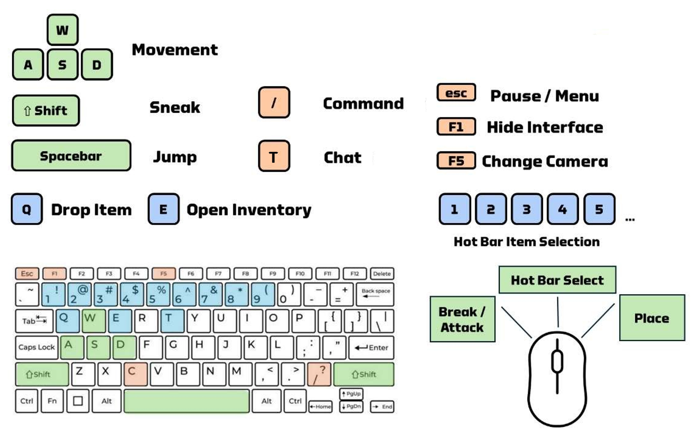
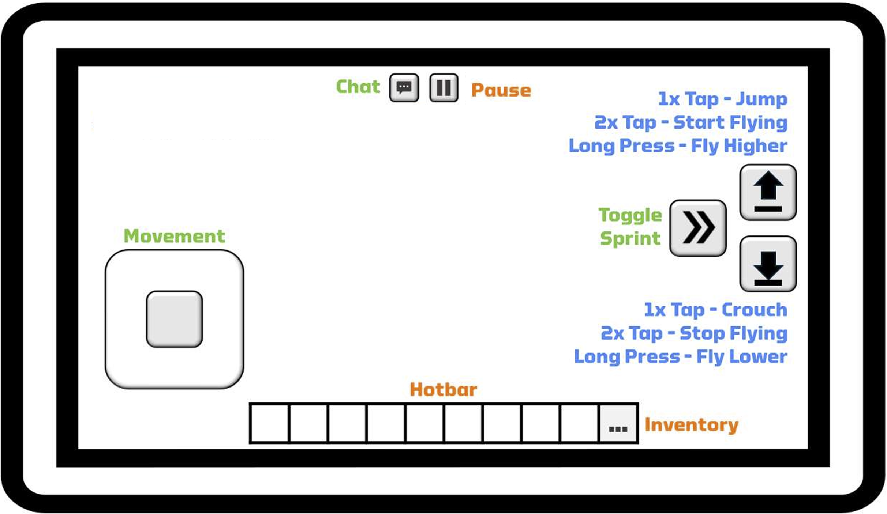

# ACDC Minecraft Controls Cheat Sheet

This guide covers the essential controls for playing in the ACDC Minecraft World.

## Keyboard and Mouse Controls

If you're new to gaming or PC gameplay, using both hands at the same time might feel unfamiliar. However, this method significantly enhances gameplay quality.

**Left Hand Positioning:** Place your left hand on the WASD keys. These keys control your movement within the game - think of them as controlling your player's legs.

**Right Hand Positioning:** Use your right hand for the mouse or trackpad, managing actions like looking around, selecting, and interacting - think of them as controlling your player's head or eyes.

### Essential Controls

**Movement**

- `W` - Move forward
- `A` - Move left
- `S` - Move backward
- `D` - Move right
- `Space` - Jump / Swim up / Fly up (in creative mode)
- `Shift` - Sneak / Swim down / Fly down (in creative mode)
- `Double-tap W` - Sprint

**Actions**

- `Left Mouse Button` - Break block / Attack
- `Right Mouse Button` - Place block / Use item / Interact
- `Mouse Wheel` - Select hotbar items
- `Middle Mouse Button` - Pick block (creative mode)

**Inventory & Items**

- `E` - Open inventory
- `Q` - Drop item
- `1-9` - Select hotbar slots
- **`9` - ACDC Menu Item** ⭐

**ACDC Commands**

- `T` - Open chat (to type commands like `/menu`, `/team list`, `/badge list`)
- `/` - Open chat with `/` already typed (quick command entry)

**View & Interface**

- `F1` - Hide/show HUD
- `F5` - Change camera view (first person/third person)
- `Esc` - Pause menu

### 🎯 ACDC-Specific Tips

- **Hotbar Slot 9 is your ACDC Menu!** Press `9` to select it, then right-click to open the main ACDC menu
- Use `/menu` command as an alternative way to access the ACDC menu
- The ACDC menu provides quick access to team management, badges, teleports, and scoreboards
- Most ACDC features can be accessed either through commands (chat) or the menu system

---

## Touchscreen Controls

For those using touchscreen devices, the controls are intuitive with on-screen icons indicating possible player actions. This interface, along with taps and long holds on the screen, dictates interaction with the in-game world.

**Note:** The keyboard and mouse setup is recommended for its ease and precision in the ACDC competition.

---

## 💡 TOP TIP!

Minecraft doesn't have an "undo" button. If a block is misplaced or destroyed, it must be manually replaced. It can be frustrating at first but it is all part of the learning process, we promise!
