# ACDC Judge Handbook

Your comprehensive guide to reviewing badge claims and managing daily category rankings.

---

## Welcome, Judge! 👨‍⚖️

As a badge judge, you play a crucial role in the ACDC Hackathon. You'll be reviewing team submissions, providing constructive feedback, and helping determine daily rankings. This handbook will guide you through everything you need to know.

**Your Role:**

- Review and evaluate badge claims for your assigned badges
- Provide constructive feedback to help teams improve
- Collaborate with other judges on daily category rankings
- Ensure fair and consistent evaluation across all teams

**Key Principles:**

- **Be encouraging** - Teams are learning and growing
- **Be fair** - Apply consistent criteria to all submissions
- **Be timely** - Teams are waiting for your decisions
- **Be constructive** - Feedback should help teams improve

---

## Quick Start: Your First Session

### 1. Verify Your Judge Role

Before you begin, make sure you have the `badge_judge` role assigned. An admin must assign this using:

```
/role add <yourName> badge_judge
```

### 2. Access the Judge Menu

The easiest way to get started is through the judge menu:

**Method 1: Command**

```
/menu judge
```

**Method 2: From Main Menu**

1. Select the ACDC block in your hotbar (slot 9)
2. Select **Judge: Badge Review**  
   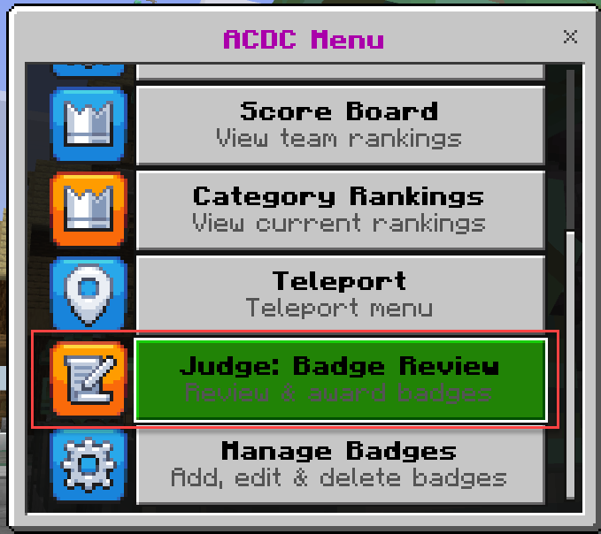

### 3. What You'll See

The judge menu has two main sections:  
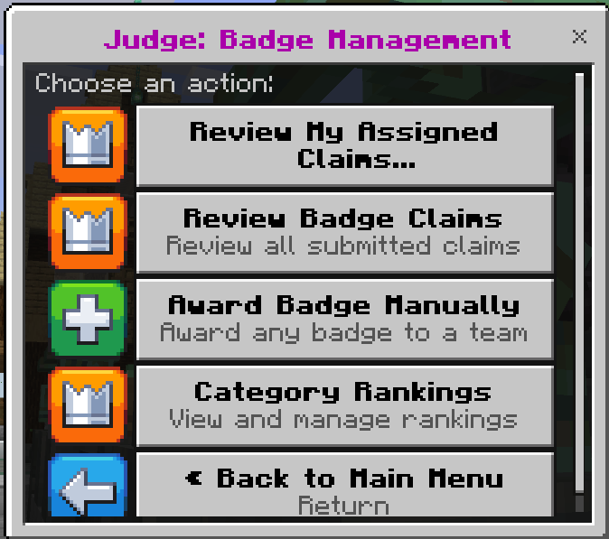

**Badge Management:**

- **Review My Assigned Claims** - See only claims for your assigned badges (recommended)
- **Review Badge Claims** - See all pending claims across all badges
- **Award Badge Manually** - Directly award a badge to a team (special circumstances)

**Category Rankings:**

- **Category Rankings** - Access the daily ranking system (see [Daily Rankings](#daily-ranking-sessions) section)

---

## Badge Review Workflow

### Understanding Badge Types

There are **two types of badges** in the competition:

#### **Claimable Badges (28 total)**

- **Categories:** Soft Badges, Low Code, Pro Code
- **Worth:** Most are 10 points (Dooh is -10 points)
- **Process:** Teams claim → You review → Approve or reject
- **Can be claimed by multiple teams**
- **Visible to players** in the badge menu

**Examples:** Community Champion, Morning Glory, Chameleon, Crawler, Client Side Salsa

#### **Challenge Badges (6 total)**

- **Category:** Challenge/Category badges
- **Worth:** 100 points (base score)
- **Process:** Awarded through daily ranking system (not claimed)
- **Hidden from players** - They cannot claim these
- **Awarded automatically** when rankings are published

**Examples:** Fabric Fera Verto, Low-Code Charms, Pro-Code Potions, Digital Transformation, ALM Magic, Magic Matrix

---

### Reviewing Badge Claims

Teams submit claims for claimable badges with a blog post URL and optional comment. Your job is to review their evidence and make a decision.

#### Option 1: Using the Menu (Recommended)

**Step 1: Open Pending Claims**

1. Run `/menu judge` or select **Judge: Badge Review** from main menu
2. Select **Review My Assigned Claims** (shows only your assigned badges)
   - Or select **Review Badge Claims** (shows all badges)

**Step 2: Select a Badge**

- You'll see a list of all badges with pending claim counts
- Select a badge that has pending claims (shown in the button text)
- Example: `Morning Glory (2 pending) Soft Badges • 10 pts`

  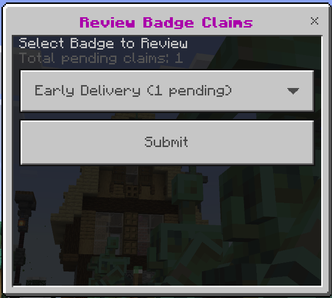

**Step 3: View Claim Details**

For each claim, you'll see:

- **Team name** and the player who submitted
- **Blog post URL/ID** - The evidence they provided
- **Submission time** - When it was submitted
- **Team's comment** - Their explanation
- **Previous rejections** (if any) - Shows feedback history

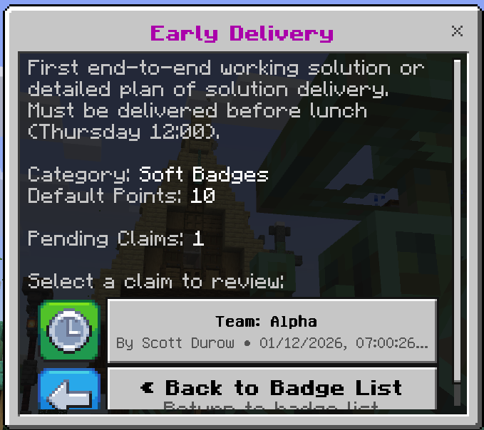

**Step 4: Make Your Decision**

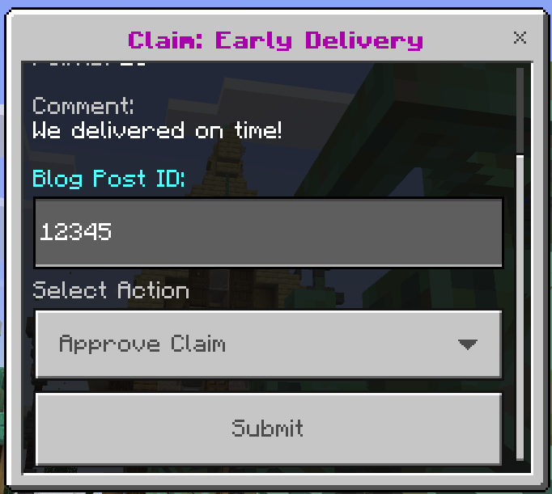

You can enter the Blog Post ID on acdc.blog to review the claim information.
**Note:** On windows, you can select the text box and use Ctrl+A Ctrl+C to copy the ID. You will not see the text selected but it will copy!

You have three options:

##### ✅ **Approve the Claim**

Use this when the team has met the badge requirements.

1. Select the claim from the list
2. Choose **Approve Claim**
3. Enter an optional message (encouragement or notes)
4. Confirm

**What happens:**

- Team members are notified immediately
- Badge points added to team score automatically
- On-screen banner shown to all players: `BADGE AWARDED`
- Claim marked as approved

##### ❌ **Reject the Claim**

Use this when the submission doesn't meet requirements. **Always provide constructive feedback!**

1. Select the claim from the list
2. Choose **Reject Claim**
3. **Enter a message** explaining why (be specific and helpful)
4. Confirm

**What happens:**

- Team members are notified with your feedback
- Team can resubmit after addressing your comments
- Your feedback is saved and shown if they reclaim

**💡 Tip:** Good rejection feedback is specific:

- ❌ "Not good enough"
- ✅ "Blog post needs screenshots showing the Power Automate flow in action"

##### ⚠️ **Skip for Now**

If you need more time or want to consult with other judges, simply go back and review it later.

#### Option 2: Using Commands

**List all pending claims:**

```
/judge claims
```

This shows all pending claims with index numbers.

**List claims for a specific badge:**

```
/badge list
/judge claimsfor <badgeId>
```

**Example:**

```
/judge claimsfor 1
```

**Approve a claim:**

```
/judge_claim approve <claimIndex> [message]
```

**Example:**

```
/judge_claim approve 1 "Excellent demonstration of Power Automate integration!"
```

**Reject a claim:**

```
/judge_claim reject <claimIndex> [message]
```

**Example:**

```
/judge_claim reject 1 "Please add screenshots of your flow configuration and test results"
```

**Manually award a badge:**

```
/judge_award <badgeId> <teamName> [points] [message]
```

**Example:**

```
/judge_award 5 "TeamAwesome" 10 "Outstanding community spirit!"
```

---

## Daily Ranking Sessions

### Overview

At the end of each day, judges participate in a **ranking session** to evaluate teams in the six Challenge categories. This is a collaborative process that determines:

- **Days 1-2:** Which team ranks #1 in each category (receives 10 pts)
- **Final Day (Day 3):** Full rankings that award points to all ranked teams using a formula

### The Six Challenge Categories

Each category has one assigned judge:

1. **Fabric Fera Verto** - Data, AI & Analytics
2. **Low-Code Charms** - Low-code solutions
3. **Pro-Code Potions** - Pro-code development
4. **Digital Transformation** - Business transformation
5. **ALM Magic** - Governance & Best Practices
6. **Magic Matrix** - Redstone Realm/M365 integration

### Understanding Judging Sessions

A **judging session** is a controlled period where:

- ✅ Scoreboard is **locked** (players can't see live updates)
- ✅ All judges can **set rankings** for their categories
- ✅ Rankings are **drafted**, **previewed**, then **published** together
- ✅ Session **auto-ends** when rankings are published

**Important:** Only one session can be active at a time.

---

### Complete Ranking Workflow

#### **Step 1: Start the Session**

One judge starts the session for all judges. Coordinate who will do this!

**Via Command (Only Option):**

```
/ranking start              # Regular day (Days 1-2)
/ranking start true         # FINAL DAY (Day 3)
```

> **Note:** Starting a session must be done via command. Once a session is active, you can use the menu (`/menu judge` → **Category Rankings**) to set rankings, preview, and publish.

**What happens:**

- System determines the next day number automatically
- Scoreboard locks for all players
- All players notified: `§e§l[JUDGING SESSION] Day X judging has started`
- All judges can now set rankings

**⚠️ WARNING:** Make absolutely sure you know whether this is the final day! The final day uses different scoring and cannot be easily undone.

---

#### **Step 2: Set Rankings (Each Judge)**

Each judge ranks teams in their assigned categories. You can rank teams multiple times before publishing.

**Via Menu (Only Option):**

1. `/menu judge` → **Category Rankings**
2. Select **Set Rankings**  
   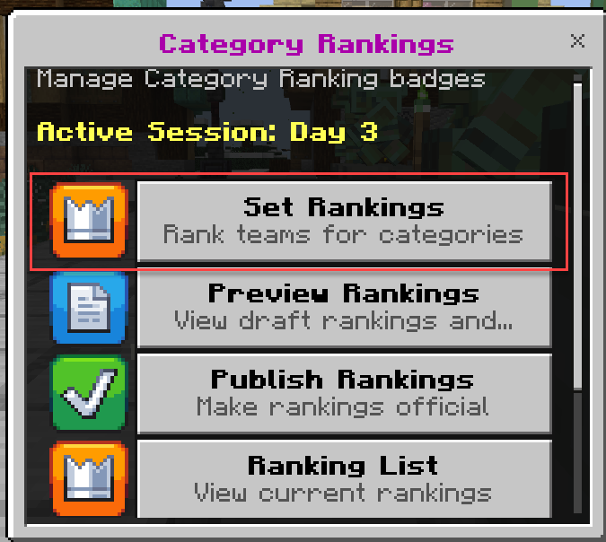
3. Choose your Challenge badge/category  
   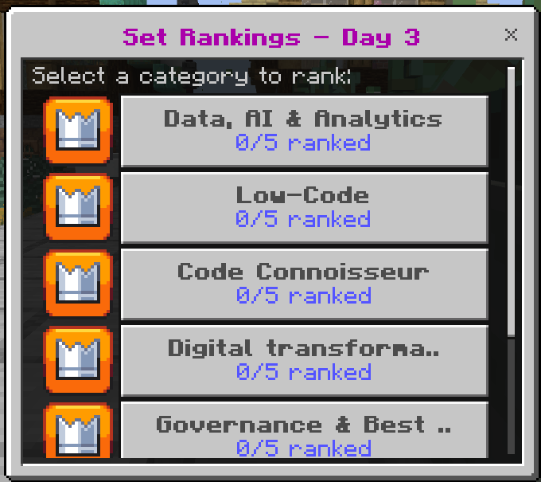
4. You'll see a list of all teams that have work in this category
5. For each team you want to rank:
   - Enter their rank number (1, 2, 3, etc.)
   - Leave blank if you don't want to rank them
6. Submit your rankings  
   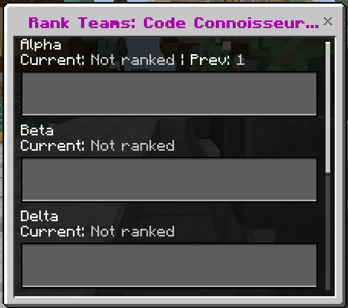

**Important Notes:**

- **Rank 1 = First place** (best team in category)
- **No duplicate ranks** - Each rank can only be assigned once
- **Unranked teams get 0 points** - Only rank teams with demonstrable work
- **You can edit** - Resubmit rankings before publishing
- **Draft rankings** - Not visible to players until published

**Example:**

- Fabric Fera Verto category has 8 teams with AI work
- You rank the top 5: Team A (1), Team B (2), Team C (3), Team D (4), Team E (5)
- 3 teams are left unranked (no points)

---

#### **Step 3: Preview Rankings**

Before publishing, **always preview** to verify everything looks correct!

**Via Menu:**

1. `/menu judge` → **Category Rankings**
2. Select **Preview Rankings**  
   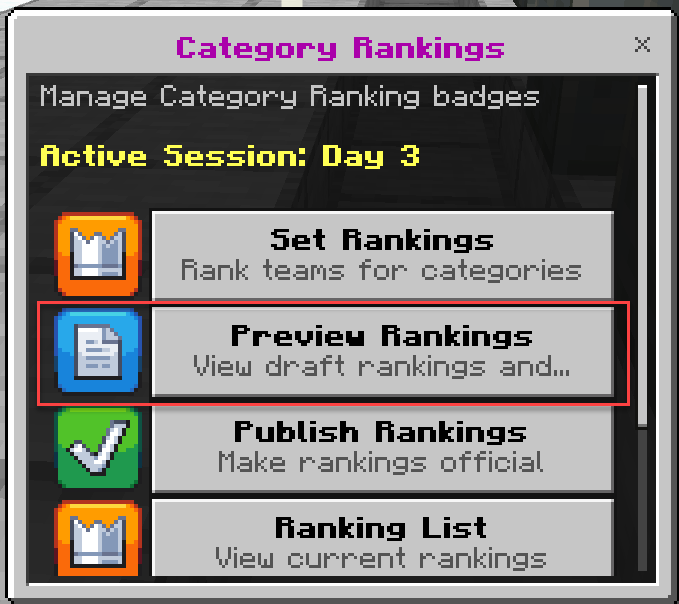
3. Review all draft rankings across all categories  
   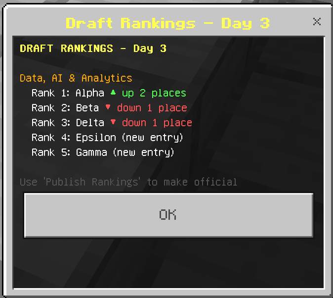

**Via Command:**

```
/ranking preview              # Current session
```

**What you'll see:**

- All categories with their rankings
- Team positions (Rank 1, Rank 2, etc.)
- **Trend indicators** (compared to previous day):
  - ⬆️ **up X places** - Team improved rank
  - ⬇️ **down X places** - Team dropped rank
  - ➡️ **no change** - Same rank as yesterday
  - 🆕 **new entry** - First time ranked in this category
- **Points to be awarded** (if final day)

**Final Day Preview Example:**

```
=== Fabric Fera Verto ===
1. Team Alpha - 100 pts ⬆️ up 1 place
2. Team Beta - 80 pts ⬇️ down 1 place
3. Team Gamma - 60 pts ➡️ no change
4. Team Delta - 40 pts 🆕 new entry
5. Team Epsilon - 20 pts ⬇️ down 2 places
```

**💡 Coordination Tip:** Share the preview with other judges to ensure consensus before publishing!

---

#### **Step 4: Publish Rankings**

Once all judges have set their rankings and reviewed the preview, publish to make it official.

**Via Menu:**

1. `/menu judge` → **Category Rankings**
2. Select **Publish Rankings**
3. Review the confirmation dialog showing:
   - Number of ranked badges
   - Number of unranked badges
   - ⚠️ Warning if this is final day
4. Confirm publication  
   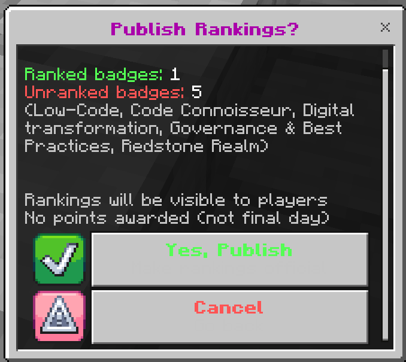

**Via Command:**

```
/ranking publish
```

**What happens:**

**For Regular Days (Days 1-2):**

1. Draft rankings → Published rankings
2. **Only Rank 1 teams** receive the category badge (10 pts each)
3. All rankings become visible to players
4. Score snapshot taken
5. Session automatically ends
6. Scoreboard unlocked
7. Players notified: `§a Day X judging is complete`

**For Final Day (Day 3/4):**

1. Draft rankings → Published rankings
2. **ALL ranked teams** receive points using the formula:
   ```
   Points = 100 - (Rank - 1) × (100 / NumTeams)
   ```
3. Badge awards created for all teams
4. Team scores updated with final points
5. **COMPETITION WINNER DETERMINED**
6. Session ends, scoreboard unlocked  
   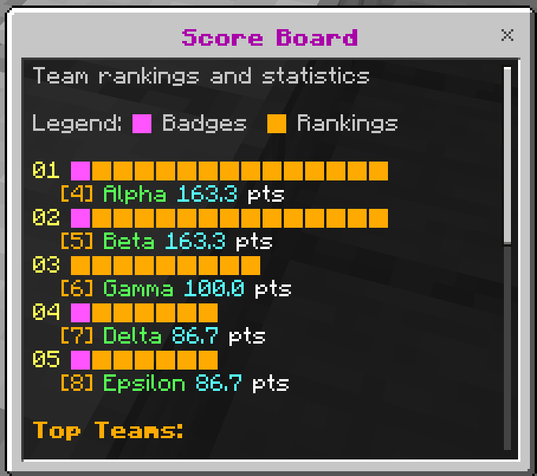
7. Players notified

**🔴 FINAL DAY WARNING:** This action cannot be undone! Only operators can reset, and it's disruptive. Triple-check before publishing!

---

### Final Day Point Calculation

Understanding how points are calculated on the final day is crucial.

**Formula:**

```
Points = BadgeScore - (Rank - 1) × (BadgeScore / NumTeams)

Where:
- BadgeScore = 100 (all Challenge badges)
- Rank = 1, 2, 3, ... (1 = first place)
- NumTeams = Total number of teams ranked in that category
```

**Example: 5 teams ranked in "Pro-Code Potions"**

| Rank | Team    | Calculation    | Points  |
| ---- | ------- | -------------- | ------- |
| 1    | Alpha   | 100 - (0 × 20) | **100** |
| 2    | Beta    | 100 - (1 × 20) | **80**  |
| 3    | Gamma   | 100 - (2 × 20) | **60**  |
| 4    | Delta   | 100 - (3 × 20) | **40**  |
| 5    | Epsilon | 100 - (4 × 20) | **20**  |

**Key Points:**

- Points decrease linearly based on rank
- The gap depends on how many teams are ranked
- More teams ranked = smaller point gaps
- Unranked teams get **0 points**

---

### Admin/Operator Ranking Commands

These commands are available to judges with operator permissions for emergency situations:

**Cancel active session:**

```
/ranking cancel
```

- Immediately ends the session
- Discards all draft rankings
- Unlocks scoreboard
- Use only in emergencies (accidental start, wrong day type)

**Reset last published day to draft:**

```
/ranking reset
```

- Reverts last published rankings back to draft state
- Removes awarded badges and points
- Reopens the session for editing
- Use if rankings were published prematurely
- **Requires double confirmation** - run the command twice within 1 minute

**Delete last day completely:**

```
/ranking undo
```

- Completely removes all rankings for the last day
- Removes all associated badge awards
- Cancels any active ranking session if one exists
- Decrements day counter
- **Destructive** - use with extreme caution
- **Requires double confirmation** - run the command twice within 1 minute

**Check session status:**

```
/ranking status
```

- Shows if a session is active
- Displays current day number
- Shows if it's marked as final day

**List all published rankings:**

```
/ranking list
```

- Shows rankings for all published days
- Useful for reference and verification

---

## Best Practices

### For Badge Reviews

**✅ Do:**

- Review claims promptly (teams are waiting!)
- Provide specific, actionable feedback on rejections
- Recognize exceptional work with encouraging messages
- Be consistent with your criteria across all teams
- Ask other judges if you're unsure about edge cases

**❌ Don't:**

- Reject without explanation
- Hold teams to unstated requirements
- Let claims pile up unreviewed
- Make exceptions for personal favorites
- Approve claims that clearly don't meet requirements

### For Daily Rankings

**✅ Do:**

- Review team work throughout the day (don't wait until the session!)
- Only rank teams with demonstrable work in your category
- Coordinate with other judges before publishing
- **ALWAYS preview** before publishing
- Double-check on final day that you're certain about rankings
- Communicate with teams about what you're looking for

**❌ Don't:**

- Rush the ranking process
- Rank teams that haven't done work in your category
- Publish without previewing
- Start the final day session unless you're 100% sure
- Rank teams inconsistently day-to-day without reason

### Communication Tips

When giving feedback on rejections:

**Be Specific:**

- ❌ "Needs more work"
- ✅ "Add screenshots showing your Canvas app running on a mobile device"

**Be Constructive:**

- ❌ "This is incomplete"
- ✅ "Include a section in your blog showing how you handled error scenarios"

**Be Encouraging:**

- ❌ "Doesn't meet standards"
- ✅ "Great start! To qualify, add details about your testing process and results"

---

## Final Day Checklist

Use this checklist to ensure a smooth final day ranking session:

### Before Starting the Session

- [ ] Confirm with ALL judges that this is the final day
- [ ] Verify all judges are ready to set rankings
- [ ] Review team work in your category throughout the day
- [ ] Have a clear ranking order in mind

### Starting the Session

- [ ] Coordinate: Who will run `/ranking start true`?
- [ ] Confirm the session is marked as **FINAL DAY**
- [ ] Verify scoreboard is locked

### Setting Rankings

- [ ] Rank all teams with demonstrable work in your category
- [ ] Leave teams with no work unranked
- [ ] Use the full ranking scale (don't just rank top 3)
- [ ] Submit your rankings through the menu

### Before Publishing

- [ ] **Run `/ranking preview`** to see all rankings
- [ ] Verify point calculations look correct
- [ ] Check trend indicators make sense
- [ ] **Coordinate with other judges** - everyone agree?
- [ ] Confirm this is FINAL - no changes after publish!

### Publishing

- [ ] One judge runs `/ranking publish`
- [ ] Read the confirmation warning carefully
- [ ] Verify it shows "FINAL DAY" in warning
- [ ] Confirm the publish

### After Publishing

- [ ] Verify scoreboard unlocked
- [ ] Check team scores updated correctly
- [ ] Announce rankings to teams
- [ ] Celebrate the competition completion! 🎉

---

## Troubleshooting

### "I don't have access to judge commands"

**Solution:** You need the `badge_judge` role. Ask an admin to run:

```
/role add <yourName> badge_judge
```

### "I can't see pending claims for my badges"

**Possible causes:**

- No claims have been submitted yet
- All claims have been reviewed
- You're not assigned as the judge for those badges

**Check:** Run `/judge claims` to see all pending claims.

### "I accidentally approved the wrong claim"

**Solution:** Only operators can undo badge awards. Contact an admin immediately. They can manually adjust scores if needed.

### "The ranking session won't start"

**Possible causes:**

- Another session is already active (run `/ranking status`)
- Previous session wasn't properly closed

**Solution:** An operator can run `/ranking cancel` to clear stuck sessions.

### "I started the final day session by mistake!"

**🚨 URGENT:**

1. **DO NOT SET RANKINGS**
2. Contact an operator immediately
3. They can run `/ranking cancel` to abort the session
4. This only works BEFORE rankings are published

### "Rankings were published with errors"

**Solution:** Only operators can fix this:

- `/ranking reset` - Reverts last day to draft (requires double confirmation)
- `/ranking undo` - Completely removes last day and cancels active session (requires double confirmation)

Both are disruptive and should be avoided!

---

## Quick Reference

### Badge Review Commands

```bash
# View pending claims
/judge claims
/judge claimsfor <badgeId>

# Review claims
/judge_claim approve <index> [message]
/judge_claim reject <index> [message]

# Manual awards
/judge_award <badgeId> <teamName> [points] [message]
```

### Ranking Commands

```bash
# Session management
/ranking start              # Regular day
/ranking start true         # Final day
/ranking status             # Check session
/ranking cancel             # Abort (operator)

# Setting rankings (use menu only)

# Publishing
/ranking preview            # Review before publish
/ranking publish            # Make official

# Admin controls (operator, require double confirmation)
/ranking reset              # Revert to draft
/ranking undo               # Delete last day + cancel active session
/ranking list               # View all rankings
```

### Menu Access

```bash
# Open judge menu
/menu judge

# Open main menu (then select judge option)
/menu
```

---

## Need More Information?

### Related Documentation

- **[Rulebook](RULEBOOK.md)** - Complete competition rules and scoring system
- **[Judge Commands](JudgeCommands.md)** - Detailed command reference
- **[Admin Commands](AdminCommands.md)** - Administrative commands (operator role)
- **[Player Quick Start](PlayerQuickStartGuide.md)** - What players see and do

### Badge Assignment

If you're not sure which badges you're assigned to, ask your admin. Badge assignments are visible in the badge management system:

```
/menu admin → Manage Badges → Assign Judge
```

### Getting Help

- Ask other judges for guidance
- Consult the rulebook for scoring details
- Contact administrators for technical issues
- Review the [complete command reference](JudgeCommands.md)

---

## Summary: Your Judge Workflow

### Daily Tasks (Days 1-2)

1. **Morning:** Review your assigned badges
2. **Throughout day:** Monitor team progress in your category
3. **As claims arrive:** Review and respond promptly
4. **End of day:** Participate in ranking session
   - Wait for session start
   - Set rankings for your category
   - Preview collectively
   - Publish when all judges ready

### Final Day (Day 3/4)

1. **Morning:** Review teams thoroughly
2. **Throughout day:**
   - Review badge claims
   - Take detailed notes on team work
3. **End of day:** Final ranking session (CRITICAL!)
   - Coordinate with all judges
   - Set rankings carefully
   - **Preview multiple times**
   - Confirm with other judges
   - Publish final rankings
4. **Announce winner!** 🏆

---

**Thank you for being a judge!** Your time, expertise, and encouragement make this competition a valuable learning experience for all participants. 🎉
