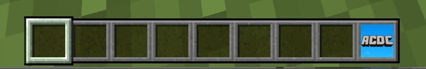
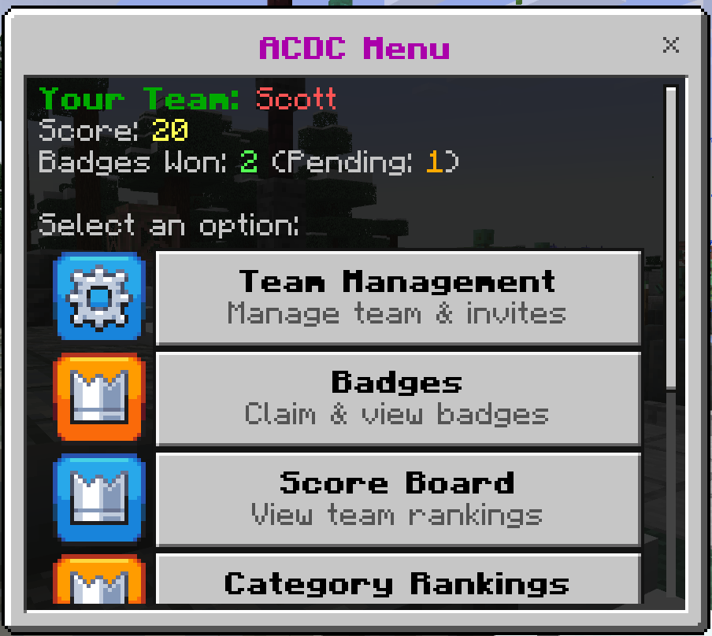
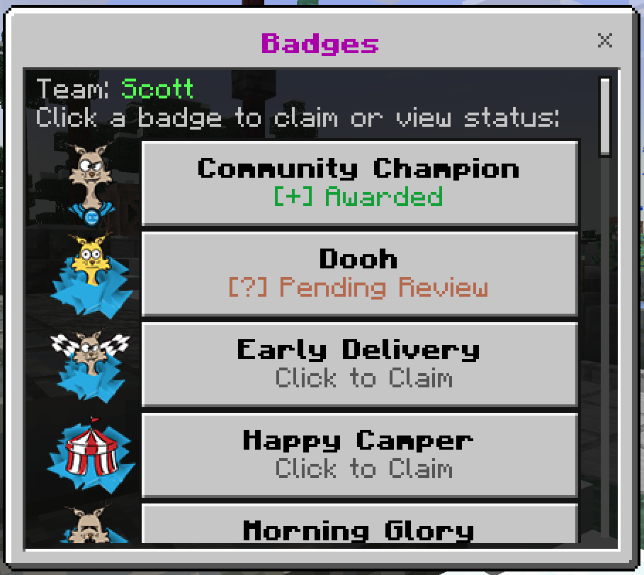
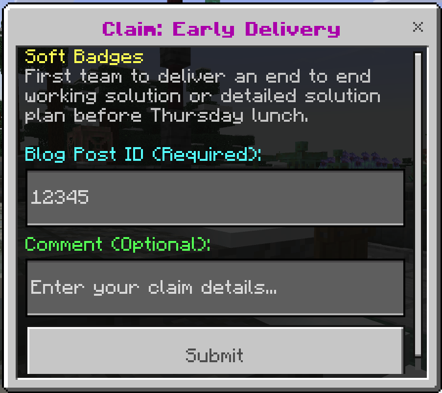
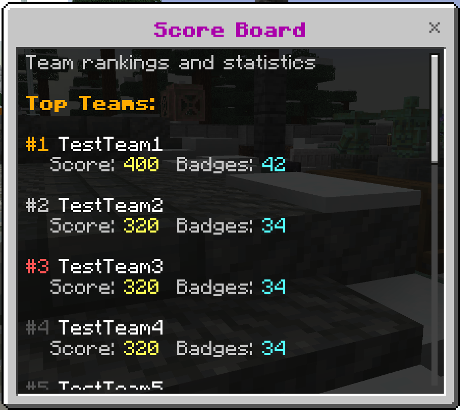
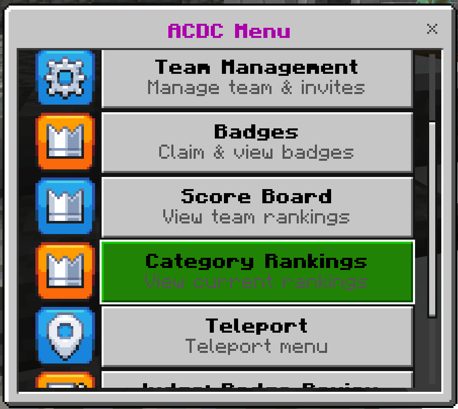
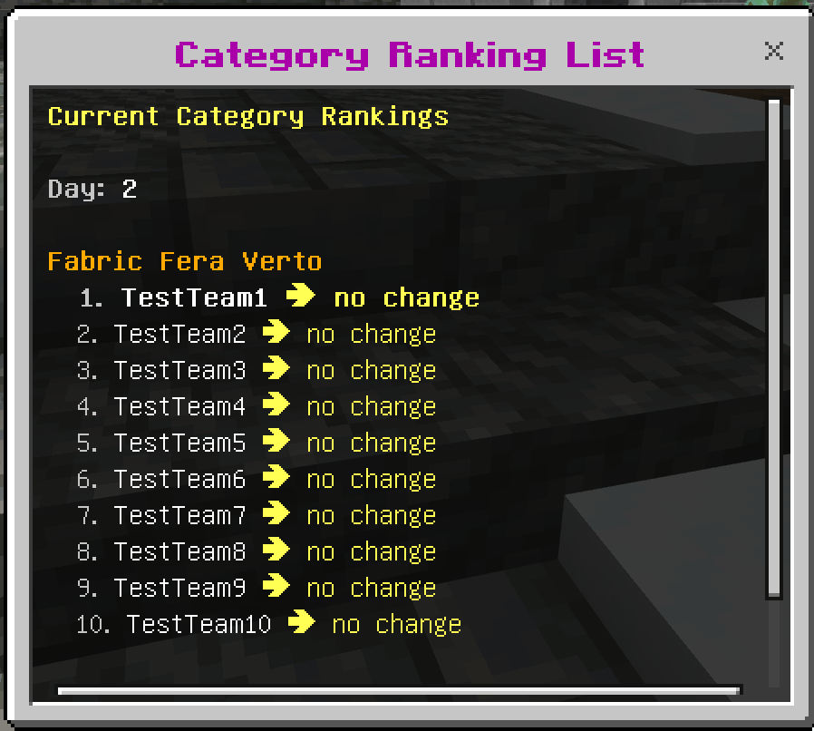
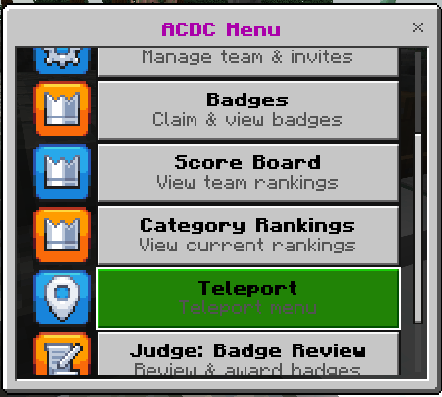
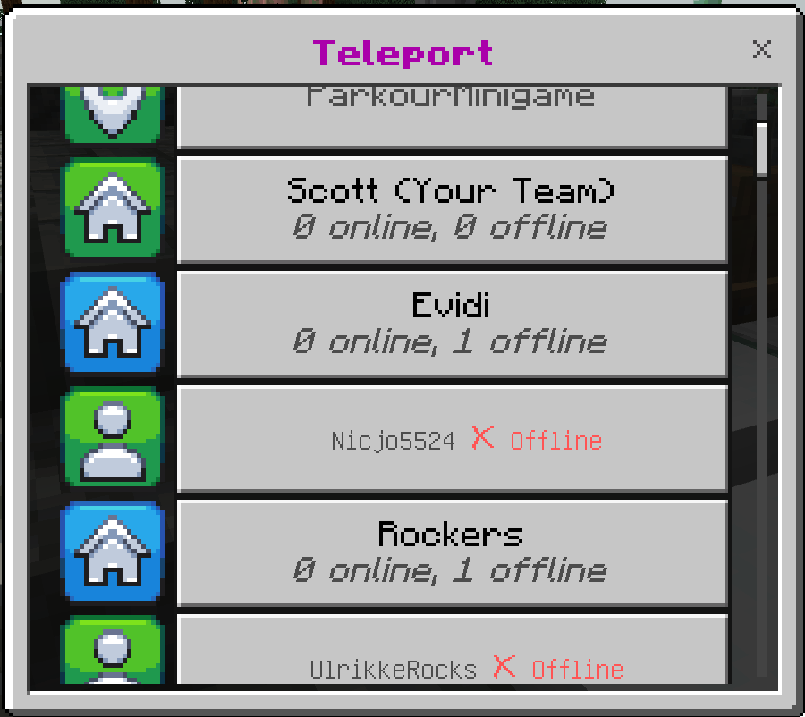

# ACDC Player Quick Start Guide

A simple guide to get started with teams, badges, and rankings.

[Minecraft Controls Cheat Sheet](https://download.microsoft.com/download/c/9/e/c9e1f3c1-eb73-4672-a073-d98847861072/Minecraft-Education-keyboard-mouse-controls.pdf)

### How to Claim a Badge

#### Option 1: Using the Menu (Recommended)

1. **Open the Badge Menu**
   
   1. Select the ACDC block in your hotbar
      (Use the mouse scroll wheel, or press 9 on the keyboard.)
      
   2. Select **Badges**
   3. Or you can run command: `/menu badges`

   
   
2. **Browse Available Badges**
   - The menu shows all available badges
   - View badge requirements, point values, and your team's claim status

     

3. **Submit Your Claim**
   - Select the badge you want to claim
   - Enter your blog post ID from acdc.blog
   - Your blog post should provide evidence of why you deserve the badge
   - Add an optional comment to help judges
   - Confirm your submission

   

4. **Wait for Judge Approval**
   - Your claim is now pending review
   - Judges will approve or reject with feedback
   - Check back later to see if it was approved!
     You will be notified in game when a judge approves/declines your claim.

#### Option 2: Using Commands

**View your team's badge status:**

```
/badge list
```

This shows all badges with their IDs, requirements, and your team's claim status.

**Claim a badge:**

```
/badge claim <badgeId> <blogPostId> [optional comment]
```

**Example:**

```
/badge claim 1 12345 "Check out our creative solution!"
```

**Note:** Your blog post on acdc.blog should include screenshots, descriptions, and evidence showing why you completed the badge requirements. The blog post ID is the numerical ID from your post.

---

### How to View Your Score and Ranking

#### Option 1: Using the Menu

1. **Open the Main Menu**
   - Select the ACDC block in your hotbar (usually slot 9)
   - Or run command: `/menu`
2. **View the Scoreboard**
   - Select "Scoreboard" from the main menu
   - See your team's rank and total points
   - View all teams' scores and rankings

   

3. **View Daily Rankings** (if published by judges)
   - Select **Category Rankings** from the main menu.
     
   - Daily rankings show category-specific placement
   - See which badges your team excels at
   - Compare performance across different days
   - Rankings show if your team moved up ⬆️, down ⬇️, or stayed the same ➡️ in each category compared to the previous day

   

#### Option 2: Using Commands

**View all team scores:**

```
/team list
```

This shows all teams with their total points in ranked order.

---

## Teleporting Around the World

### Teleport to Team Bases

**Via menu:**

1. Open the **teleport** menu  
   
2. Choose the team you want to visit. Your team will always be first, followed by the other teams.
   

**Via command:**

```
/acdc:tp team <teamName>
```

### Teleport to Special Regions

Some locations are available to help you explore and travel.

**Via menu (Recommended):**

1. Open the **teleport** menu
2. Browse the list and choose a region to visit

This is the easiest way to see all available regions and teleport to different areas.

**Via command:**

**List all available regions:**

```
/acdc:tp listregions
```

This shows all regions you can access.

**Teleport to a specific region:**

```
/acdc:tp region <regionName>
```

**Examples:**

- `/acdc:tp listregions` - See all available regions
- `/acdc:tp region Wilderness` - Teleport to the Wilderness biome
- `/acdc:tp region Village` - Teleport to the Village

---

## For Team Leaders: Creating & Managing Your Team

### Step 1: Get the Team Creation Password

- Ask a game administrator or judge for the team creation password
- This password is required to create new teams

### Step 2: Create Your Team

**Use the command:**

```
/team create <teamName> <creationPassword>
```

**Example:**

```
/team create "Awesome Builders" secret123
```

**Success!**

- You are now the team owner
- You can start inviting members

---

### Step 3: Claim Your Team's Land

Once you've created your team, you'll want to claim land for your team base.

#### Finding the Perfect Location

1. **Explore the World**
   - Travel around and find a location you like for your team base
   - Use the teleport menu (easiest) or `/tp region <regionName>` to visit different biomes
   - Available biome regions include: Wilderness, Desert, and others
   - Make sure you're not too close to another team's claimed land
   - Your claim cannot be adjacent to another team's territory
   - Choose carefully - this will be your team's home!

2. **Claim Your Land**
   - Stand at the spot where you want your team base center to be
   - This location will become the teleport point for your team
   - Run the command:

   ```
   /land claim
   ```

3. **Your Protected Region**
   - A border will appear defining your team's protected region
   - Only your team members can build within this area
   - You'll automatically be in Creative mode inside your team region
   - Your team's total score will be displayed at the claim center

     

**Remove your team's land claim (if needed):**

```
/land unclaim
```

(You must be standing in your team's claimed area)

**Important Notes:**

- The claim center is where you run the `/land claim` command
- This becomes your team's teleport destination
- Only team owners can claim or unclaim land
- You can only have one land claim per team
- Claims must not be adjacent to other teams' claims

---

### Step 4: Invite Team Members

#### Using the Menu

1. **Open the Team Menu**
   - Run command: `/menu team`
2. **Select "Manage Members"**
   - Choose "Invite Player"
   - Enter the player's name
   - They will receive an invitation
3. **Players Accept the Invite**
   - Invited players use `/team join <yourTeamName>` to join

#### Using Commands

**Invite a player:**

```
/team_member invite <playerName>
```

**Example:**

```
/team_member invite Steve
```

**View pending invites:**

```
/team_member invites
```

**Cancel an invite:**

```
/team_member uninvite <playerName>
```

---

### Step 5: Manage Your Team (Owner Only)

#### Viewing Team Members

- Use the team menu to see all members
- Or use command: `/team list`

#### Removing Members

**Via menu:**

1. Open team menu → Manage Members → Remove Member
2. Select the player to remove

**Via command:**

```
/team_member remove <playerName>
```

#### Promoting Co-Owners

You can promote team members to co-owner status (they can also manage invites and members):

```
/team_member promote <playerName>
```

To demote back to regular member:

```
/team_member demote <playerName>
```

#### Leaving Your Team

If you want to leave your own team:

```
/team leave
```

⚠️ **Note:** Make sure to promote someone else to owner first, or your team may be left without an owner!

---

## Quick Reference Commands

### Badge Commands

- `/menu badge` - Open badge menu
- `/badge list` - View your team's badges
- `/badge claim <badgeId> <blogPostId> [comment]` - Claim a badge

### Team Commands

- `/menu team` - Open team menu
- `/team create <name> <password>` - Create team (owners)
- `/team join <name>` - Join team (after invite)
- `/team leave` - Leave your team
- `/team list` - View all teams and scores

### Team Member Management (Owners Only)

- `/team_member invite <player>` - Invite player
- `/team_member uninvite <player>` - Cancel invite
- `/team_member remove <player>` - Remove member
- `/team_member promote <player>` - Make co-owner
- `/team_member demote <player>` - Demote to member
- `/team_member invites` - List pending invites

### Other Useful Commands

- `/menu main` - Open main menu
- `/acdc:tp to <player>` - Teleport to another player
- `/acdc:tp team <teamName>` - Teleport to team's land
- `/acdc:tp region <regionName>` - Teleport to a region
- `/acdc:tp list` - List available players
- `/acdc:tp listregions` - List all available regions

---

## Need Help?

- For complete command documentation, see [Commands.md](Commands.md)
- Player commands: [PlayerCommands.md](PlayerCommands.md)
- Judge commands: [JudgeCommands.md](JudgeCommands.md)
- Admin commands: [AdminCommands.md](AdminCommands.md)

---

## Tips for Success

✅ **Claim early** - Submit badge claims as soon as you complete the requirements  
✅ **Provide good evidence** - Write detailed blog posts on acdc.blog with screenshots and explanations  
✅ **Work as a team** - Coordinate with your team members on which badges to pursue  
✅ **Check rankings** - Monitor your progress and see where you can improve  
✅ **Communicate** - Keep your team organized with clear roles and goals
