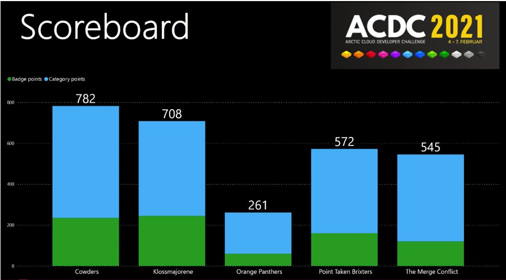

## Hackathon Rule Book

Scoring is built around two types of recognition:

- **Collectible badges**: Claimed by teams and awarded by judges
- **Judging categories**: Ranked by judges, with points awarded based on the final rankings at the end of the hackathon

---

### 1. Collectible badges

- Collectible badges are available to be claimed by teams across all three days.
- In addition to the core set of collectible badges, there are also occasional Head2Head/Sponsor challenge badges that are announced during the hackathon with details on how to qualify. These collectible badges are claimed in the same way as the core badges; however, they may have special rules such as it is only awarded to the first team to claim it.
- Each collectible badge has an assigned judge responsible for reviewing claims.
- Teams must claim a badge to be considered.
- Each claim must include a link to a blog post explaining why the team should be awarded the badge.
- The assigned judge reviews the claim and either:
  - Awards the badge, or
  - Declines the badge with comments.
- If declined, the team may submit a new claim after addressing the feedback.
- Once awarded, a badge cannot be claimed again by the same team.

**Collectible badge points:**

- Most collectible badges are worth **10 points**.
- The **Dooh badge** is worth **-10 points**. It is fully expected that every team claims this badge unless they claim and can testify to the judges that they have never made a mistake.

The intent is that all teams should earn all collectible badges. These points reward engagement and learning but are not intended to be the most significant influence on the final outcome.

---

### 2. Judging categories

There are **six judging categories**, each with **one assigned judge**.

For each category:

- The assigned judge is responsible for ranking teams at the end of **each day**.
- A team is only ranked if it has demonstrable work in that category.
- If a team has done nothing in a category, it does not receive a rank.
- Daily rankings are used to determine the top team in each category for that day.
- At the *end* of Day 1 and Day 2, **only** the top-ranked team in each category receives that day's **category badge** and is awarded 10 points.
- The ranking position of each team in each category is then visible to all teams to view.

---

### 3. Final category judging and scoring

At the end of **Day 3**, final judging is performed:

- Each judge produces a final ranked list for their category.
- Only teams included in the final ranking receive category points.
- Category points are calculated as:

CategoryPoints = 100 − (Rank − 1) × (100 / N)

*Where:*

- **Rank** is the team's final position in the category
- **N** is the number of teams that received a rank in that category

- Teams that do not receive a rank earn **no points** for that category.

---

### 4. Winning Team

The team with the most total points from both collectible badges and category points is the winner of the hackathon.

## Categories/Badges

The following table contains the badges:

| **Badge Name**                  | **Category**                      | **Description**                                              | **Judge** |
| ------------------------------- | --------------------------------- | ------------------------------------------------------------ | --------- |
| **Data, AI & Analytics**        | Judging  Category                 | From raw  blocks to data diamonds: Use Fabric to mine and shape all your raw data,  surface insights in Power BI visualizations, and prepare strong foundations  with Fabric IQ so agents and data scientists can discover the true gems. If  it’s not valuable, keep refining! ⛏️💎 | Cathrine  |
| **Low-Code**                    | Judging  Category                 | I really love  the simplicity of Low code, but also the extent to how far Low code can be  taken without having to write PCF or use code. Intelligent and practical  usage of the Low code capabilities across the PowerPlatform components is  what I'm looking for. Go check out my village for some clues. | Fredrik   |
| **Code Connoisseur**            | Judging  Category                 | Psst, come  closer - it's all about the code... AI tools: built using code. Data  products: coded into existence. Low-code drag-and-drop stuff: the output of a  codefest!  Demonstrate  how code solves a problem. Be innovative, show off, blow our minds! | Keith     |
| **Digital transformation**      | Judging  Category                 | Deliver a  solution that helps businesses do more with less, improving customer  experience using intelligent automation. Strong entries show measurable  impact, improved customer or employee experience, and a clear understanding  of how the solution would work in the real world. | Shannon   |
| **Governance & Best Practices** | Judging  Category                 | AI Governance & Best Practices:     I will be evaluating hackathon  projects with a focus on responsible AI governance and best practices. This  includes assessing how teams address ethics, transparency, data privacy,  security, fairness, regulatory compliance, and risk management, as well as  how thoughtfully AI is integrated into real-world use cases. Emphasis will be  placed on accountable, and trustworthy AI design. | Scott     |
| **Redstone Realm**              | Judging  Category                 | Craft a real  business solution using the power of Microsoft 365 / Dynamics 365  —SharePoint, Teams, Viva Village, Azure lake and more. Whether you’re working  on desktop or web, using audio, video, keyboard, touch, mouse, or even a  chatty parrot perched on your shoulder, build something both effective and  adventure-worthy.     In this  whirlwind era of AI evolution, you’re not just placing blocks—you’re forging  an AI-infused pickaxe that helps you mine insights faster than ever.  Prioritize accessibility, privacy, and a smooth player experience.     Harness AI, LLMs, Copilot Studio,  Agents, or your own redstone-and-command-block fusion of innovation to bring  your creation to life—the  crafting table is yours… start building! | Mikael    |
| **Community Champion**          | Claimable  Badge                  | Goes out of their way to help and encourage  other teams.    | Shannon   |
| **Dooh**                        | Claimable  Badge                  | Goes out of their way to create something  extraordinarily useless or does something really really stupid! | Mikael    |
| **Early Delivery**              | Claimable  Badge      Soft Badges | First end-to-end working solution or  detailed plan of solution delivery. Must be delivered before lunch (Thursday  12:00). | Scott     |
| **Happy Camper**                | Claimable  Badge      Soft Badges | Using gadgets, costumes or similar to  create a really cool camp, and keep extraordinary team spirit throughout the  event. | Cathrine  |
| **Morning Glory**               | Claimable  Badge                  | Starting the day before the sun rises.                       | Shannon   |
| **Remarkable Teamspirit**       | Claimable  Badge                  | Keeps an extraordinary good team spirit  throughout the day. Snap a picture and post to social media to spread the  word. | Shannon   |
| **Sharing is Caring**           | Claimable  Badge                  | Code, dataset or Api is made available for  other teams and you do a sensible contribution (pull request, Integration) on  a competing teams solution. | Mikael    |
| **Thieving Bastards**           | Claimable  Badge                  | Uses several third-party solutions in the  delivery, opensource or payable solutions made available by others. Show the  importance of leveraging existing tools and APIs. | Fredrik   |
| **Chameleon**                   | Claimable  Badge                  | Solution is  responsive. Adapts to all devices and screen sizes | Cathrine  |
| **Crawler**                     | Claimable  Badge                  | Using search  in an innovative, useful way. Solve a business problem! | Mikael    |
| **Dash It Out**                 | Claimable  Badge                  | Create great  looking dashboards with graphs, kpis and reports using your preferred data  visulization framework. Minimum 4 graphs, gauges or kpi's. Make sure the  dashboard shows business-value | Cathrine  |
| **Dataminer**                   | Claimable  Badge                  | Uses external  data to add business-value to existing data in your solution, or mine after  gold in you own data and present it in an excellent way. | Cathrine  |
| **Embedding numbnut**           | Claimable  Badge                  | Integrate  into everything that flips bits                   | Cathrine  |
| **Feature Bombing**             | Claimable  Badge                  | On popular  demand the feature bombing badge is back! But this time cram as many user  features into one screen as you can. Five or more and you might get some  points. If you go all aboard and it all makes sense, extra points | Scott     |
| **Glossy Pixels**               | Claimable  Badge                  | Shiny,  beautiful, glossy user interfaces would earn this badge, it won't break on  small screens right? | Cathrine  |
| **Go With The Flow**            | Claimable  Badge                  | Implement  workflow to improve business productivity in a solution. Do you have a  process that can be automated? | Fredrik   |
| **Hipster**                     | Claimable  Badge                  | Show use of  the hippest coolest tech.                       | Fredrik   |
| **Nasty Hacker**                | Claimable  Badge                  | Creating  superdirty hacks to achieve awesomeness            | Keith     |
| **Plug N' Play**                | Claimable  Badge                  | This is all  about Apps. Create an app/plugin for a Microsoft Product (Teams, SharePoint,  Dynamics, Office 365, VS Code, Visual Studio etc.). And don't forget that it  has to solve a business need. | Scott     |
| **Power User Love**             | Claimable  Badge                  | Show a good  example of how to use your preffered low-code platform combined with pro code  customization. | Fredrik   |
| **Retro badge**                 | Claimable  Badge                  | Doing  something cool with late technologies. It's all legacy now, baby! | Mikael    |
| **Show And Tell**               | Claimable  Badge                  | Got a great,  well thought idea with some cool sketches? Maybe you can get a badge for  that. | Shannon   |
| **Stairway To Heaven**          | Claimable  Badge                  | Combine at  least three different Microsoft cloud Api's and the badge could be yours! | Keith     |
| **The Existential Risk**        | Claimable  Badge                  | Demonstrate  and integrate AI that shows an existential risk for the world. Does your  solution have a conscience? Can it think on its own, Is it smarter than a  5'th grader? | Mikael    |
| **ACDC Craftsman**              | Claimable  Badge                  | Practicing  development and deployment best-practice. Can only be claimed on day 3 in a  single post, where you demonstrate true ACDC craftmanship. | Scott     |
| **Client Side Salsa**           | Claimable  Badge                  | Showcases  well structured, modern client-side solutions with attention to performance,  maintainability, and a great user experience. | Keith     |
| **Power Of The Shell**          | Claimable  Badge                  | Script the  config of your entire solution. Azure infrastructure as code, ARM,  PowerShell, CI/CD | Keith     |
| **Right Now**                   | Claimable  Badge                  | Doing  something collaborative in real-time with socket.io, signalR, WebSocket etc.  Don't repeat yourself! Expecting to see code on this one. | Keith     |
| **Best Build**                  | Claimable  Badge                  | Awarded to  the best build inside team claim land            | Fredrik   |
| **Escape the Screen**           | Head2Head                         | Your  challenge is to create an interactive experience which escapes the confines  of the screen!  It might be a  game which turns external lights on or off; maybe it's a mischievous chatbot  which accepts voice commands but prints out its answers; could it be a  strange app which plays music.  Show us the  power of your imagination. | Keith     |

## Sponsorship Badge

The following table contains the sponsorship badges:

| **Badge Name**                  | **Category**                      | **Description**                                              | **Judge** |
| ------------------------------- | --------------------------------- | ------------------------------------------------------------ | --------- |
| **Sponsorship Badge 1**         | Sponsorship                       | Description for Sponsorship Badge 1                          | TBD       |
| **Sponsorship Badge 2**         | Sponsorship                       | Description for Sponsorship Badge 2                          | TBD       |
| **Sponsorship Badge 3**         | Sponsorship                       | Description for Sponsorship Badge 3                          | TBD       |
| **Sponsorship Badge 4**         | Sponsorship                       | Description for Sponsorship Badge 4                          | TBD       |

 

# Judges Gamertags

| **Tag**             | **Name** | **Badge Count** |
| ------------------- | -------- | --------------- |
| **WobbaBoyza**      | Mikael   | 5               |
| **SheriffOfNottm**  | Keith    | 5               |
| **Fredrik C3**      | Fredrik  | 5               |
|                     | Cathrine | 5               |
| **Shannanigans736** | Shannon  | 4               |
| **ScottDurow**      | Scott    | 4               |

 

------
